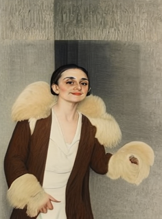

# vid2smpl

[](data/test1.mp4)

## Overview

This repository is aimed to process human video sequences using a 3D human parametric model, to be used as inputs for video generation methods such as the latest [Champ](https://github.com/fudan-generative-vision/champ). Given a video input, the code returns the following types of output for each frame:

* DWPose
* Human Depth Map (SMPL-based)
* Human Mask (SMPL-based)
* Human Normal Map (SMPL-based)
* Human Semantic Map (SMPL-based)

vid2smpl is compatible with Champ and many other video generation frameworks for human animation.

## Installation

Tested System: Ubuntu20.04, Cuda 12.1 \
Tested GPUs: A100 \
Main dependencies : 
* torch, torchvision
* pytorch3d
* opencv, pillow, imageio-ffmpeg

More specific installation instructions coming soon...

### Model Checkpoints : 

Install the [HybrIK](https://github.com/Jeff-sjtu/HybrIK) checkpoint from the [Google Drive](https://drive.google.com/file/d/1R0WbySXs_vceygKg_oWeLMNAZCEoCadG/view) link and place the file on the checkpoints/hybrik directory.

Install the [SMPLX](https://smpl-x.is.tue.mpg.de/index.html) model files from the website link and unzip the files on the checkpoints/smplx directory.

For the Human Semantic Map, which is based on SMPLX, go to the [Meshcapade](https://meshcapade.wiki/SMPL) wiki and download the segmentation data on [link](https://meshcapade.wiki/assets/SMPL_body_segmentation/smplx/smplx_vert_segmentation.json). 

(Note that the authors of [Champ](https://github.com/fudan-generative-vision/champ) haven't fully revealed their preprocessing code. This is an estimate of what they have done based on the example data, and might change depending on the official release)

The [DWPose](https://github.com/IDEA-Research/DWPose) files will be automatically downloaded at inference.

In the end, the checkpoints should be organized as the following : 
```
./checkpoints/
|-- hybrik
|   |-- hybrikx_rle_hrnet.pth
|-- openpose
|   |-- dw-ll_ucoco_384.onnx
|   |-- yolox_l.onnx
|-- smplx
|   |-- SMPLX_NEUTRAL.npz
|   |-- smplx_kid_template.npy
|   |-- smplx_verts_segmentation.json
```

## Inference

Run the script 

```
python main.py \
    --input_path $input_path \ # Input. Can be video, single image, or a folder containing images
    --output_path $output_path \ # Folder that saves the output results of vid2smpl 
    --device $device \ # CUDA device for processing 
    --sample_vid # Returns a video containing all outputs in the output folder
```

The process will take approximately 2 seconds per frame and 6~7 GB VRAM when ran on a single GPU.

Output structure : 
```
output_path/
|-- depth
|-- dwpose
|-- frames
|-- mask
|-- normal
|-- semantic_map
`-- output_name.mp4
```

The output is designed to be compatible with Champ, and you can simply change the `guidance_data_folder` of Champ's config file with the output folder.

Example Output Video from Champ, directly from the extracted results:

[](data/test2.mp4)

## To-do

- [ ] Polish Documentation
- [ ] Add other SMPLX-based human detection methods
- [ ] Incorporate Densepose

## Acknowledgments

We thank the authors of :

* [HybrIK](https://github.com/Jeff-sjtu/HybrIK)
* [DWPose](https://github.com/IDEA-Research/DWPose)
* [sd-webui-controlnet](https://github.com/Mikubill/sd-webui-controlnet)
* [Pytorch3D](https://github.com/facebookresearch/pytorch3d)
* [SMPLX](https://smpl-x.is.tue.mpg.de/)
* [Champ](https://github.com/fudan-generative-vision/champ)

## Citation

This paper was based upon the following works : 
```
@inproceedings{li2021hybrik,
    title={Hybrik: A hybrid analytical-neural inverse kinematics solution for 3d human pose and shape estimation},
    author={Li, Jiefeng and Xu, Chao and Chen, Zhicun and Bian, Siyuan and Yang, Lixin and Lu, Cewu},
    booktitle={Proceedings of the IEEE/CVF Conference on Computer Vision and Pattern Recognition},
    pages={3383--3393},
    year={2021}
}

@article{li2023hybrik,
    title={HybrIK-X: Hybrid Analytical-Neural Inverse Kinematics for Whole-body Mesh Recovery},
    author={Li, Jiefeng and Bian, Siyuan and Xu, Chao and Chen, Zhicun and Yang, Lixin and Lu, Cewu},
    journal={arXiv preprint arXiv:2304.05690},
    year={2023}
}

@inproceedings{yang2023effective,
  title={Effective whole-body pose estimation with two-stages distillation},
  author={Yang, Zhendong and Zeng, Ailing and Yuan, Chun and Li, Yu},
  booktitle={Proceedings of the IEEE/CVF International Conference on Computer Vision},
  pages={4210--4220},
  year={2023}
}

@article{ravi2020pytorch3d,
    author = {Nikhila Ravi and Jeremy Reizenstein and David Novotny and Taylor Gordon
                  and Wan-Yen Lo and Justin Johnson and Georgia Gkioxari},
    title = {Accelerating 3D Deep Learning with PyTorch3D},
    journal = {arXiv:2007.08501},
    year = {2020},
}

@inproceedings{SMPL-X:2019,
  title = {Expressive Body Capture: {3D} Hands, Face, and Body from a Single Image},
  author = {Pavlakos, Georgios and Choutas, Vasileios and Ghorbani, Nima and Bolkart, Timo and Osman, Ahmed A. A. and Tzionas, Dimitrios and Black, Michael J.},
  booktitle = {Proceedings IEEE Conf. on Computer Vision and Pattern Recognition (CVPR)},
  pages     = {10975--10985},
  year = {2019}
}

@misc{zhu2024champ,
      title={Champ: Controllable and Consistent Human Image Animation with 3D Parametric Guidance},
      author={Shenhao Zhu and Junming Leo Chen and Zuozhuo Dai and Yinghui Xu and Xun Cao and Yao Yao and Hao Zhu and Siyu Zhu},
      year={2024},
      eprint={2403.14781},
      archivePrefix={arXiv},
      primaryClass={cs.CV}
}
```